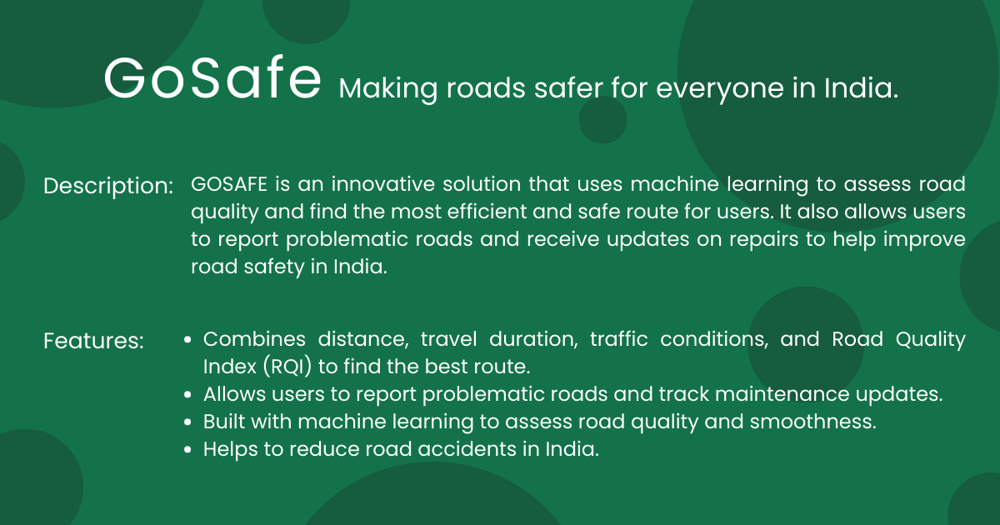

<html>
  

  <h1> GoSafe </h1>
  <h3>GoSafe is a machine learning-based routing app that finds the most efficient and safe route for users, while also allowing them to report and track road maintenance in order to improve road safety in India.
</h3>
  

  

    
  

  

</html>
